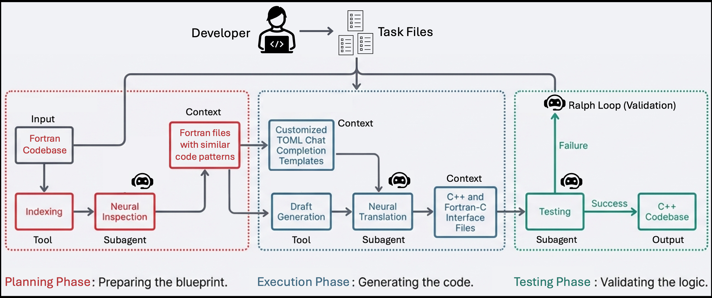

.. |icon| image:: ./media/icon.svg
   :width: 35

###################
 |icon| Codescribe
###################

|Code style: black|

**********
 Overview
**********

Codescribe is an AI-assisted framework for scientific software
development. Its original focus is incremental Fortran-to-C++
translation, including generation of corresponding C++ source files and
Fortran-C++ interface layers, but the current codebase also supports
general code inspection, generation, update, and agentic workflows.
Codescribe can talk to multiple large language model (LLM) backends via
hosted APIs, OpenAI-compatible endpoints, or local Transformers models,
and it supports both prompt-driven and tool-using workflows. This makes
it useful both for modernizing legacy scientific codes and for broader
code-generation and maintenance tasks.

***********
 Resources
***********

-  Papers:

   -  https://arxiv.org/abs/2410.24119

-  Tutorials:

   -  https://github.com/akashdhruv/ralph-with-poisson
   -  https://anl.box.com/s/zv3zdbphqprdz8rjh1c84xpeqd8yg32u
   -  https://github.com/akashdhruv/codescribe-tutorial.git

-  Use cases:

   -  https://erf.readthedocs.io/en/latest/CouplingToNoahMP.html
   -  https://mcfm.fnal.gov

-  Demo:

   -  https://doi.org/10.5281/zenodo.18853292

**************
 Key Features
**************

-  Incremental Translation: Translate Fortran codebases into C++
   incrementally, creating Fortran-C++ layers for seamless
   interoperability.

   |fig1|

-  Custom Prompts: Automatically generate prompts for generative AI to
   assist with the conversion process.

-  Language Model Integration: Use OpenAI, Anthropic, ARGO,
   OpenAI-compatible endpoints, or local Transformers checkpoints.

   |fig2|

-  Fortran-C++ Interfaces: Generate the necessary interface layers
   between Fortran and C++ for easy function and subroutine conversion.

-  Code Generation and Update: Create new source files or modify
   existing ones from natural-language prompts.

-  Agentic Coding: Run iterative tool-using agents with ``read``,
   ``glob``, ``bash``, ``edit``, and ``write`` tools.

-  Bounded Project Loops: Run repeated, fresh-session coding loops over
   a task file while constraining tool access to the working tree.

*******************
 Statement of Need
*******************

In scientific computing, translating legacy Fortran codebases to C++ is
necessary to leverage modern libraries and ensure performance
portability across various heterogeneous high-performance computing
(HPC) platforms. However, bulk translation of entire codebases often
results in broken functionality and unmanageable complexity. Incremental
translation, which involves creating Fortran-C++ layers, testing, and
iteratively converting the code, is a more practical approach.
Codescribe supports this process by automating the creation of these
interfaces and assisting with generative AI to improve efficiency and
accuracy, ensuring that performance and functionality are maintained
throughout the conversion. Additionally, Codescribe facilitates code
generation and updates, enabling users to create new applications or
modify existing files seamlessly.

**************
 Installation
**************

Codescribe uses ``pyproject.toml`` to declare its build system and
dependencies. We recommend installing in a virtual environment:

.. code:: bash

   python3 -m venv env
   source env/bin/activate
   pip install --upgrade pip

Install Codescribe and its core dependencies using ``pip`` in editable
mode:

.. code:: bash

   pip install -e .

To also install the optional Hugging Face / Transformers backend:

.. code:: bash

   pip install -e ".[transformers]"

Editable mode enables testing of features/updates directly from the
source code and is an effective method for debugging.

***************
 Quick Start
***************

Set your API key and run a one-shot agent task:

.. code:: bash

   export ANTHROPIC_API_KEY="sk-ant-..."
   code-scribe agent "Write a hello world Python script to hello.py" \
       -m anthropic-claude-sonnet-4-6 --verbose

The agent uses the ``write`` tool to create ``hello.py`` and emits a
``<final_answer>`` when done. With ``--verbose`` you see each tool call
and token usage as it runs.

To run a multi-session bounded loop over a task file:

.. code:: bash

   code-scribe loop task.toml -m anthropic-claude-sonnet-4-6 --verbose

See `docs/loop.md <docs/loop.md>`__ for the task file format and
bounded-tool policy.

*******
 Usage
*******

You can use the `--help` option with every command to get a better
understanding of their functionality.

.. code:: bash

   ▶ code-scribe --help
   Usage: code-scribe [OPTIONS] COMMAND [ARGS]...

     Software development tool for code conversion, generation, and
     agentic workflows in scientific computing

   Options:
     -v, --version
     --help         Show this message and exit.

   Commands:
     agent      Run a tool-using coding agent on a task
     draft      Perform a draft conversion from Fortran to C++
     format     Format TOML seed prompt files
     generate   Perform AI-based code generation
     index      Index Fortran files along a project directory tree
     inspect    Perform AI code inspection on files
     loop       Run repeated bounded agent sessions over a task file
     translate  Perform AI-based code conversion of Fortran files
     update     Perform AI-based code update on files

Following is a brief overview of different commands:

#. ``code-scribe index <project_root_dir>`` - Parses the project
   directory tree and creates a ``scribe.yaml`` file at each node along
   the directory tree. These YAML files contain metadata about
   functions, modules, and subroutines in the source files. This
   information is used during the conversion process to guide LLM models
   in understanding the structure of the code.

   .. code:: yaml

      # Example contents of scribe.yaml
      directory: src
      files:
        module1.f90:
          modules:
            - module1
          subroutines:
            - subroutine1
            - subroutine2
          functions:
            - function1

        module2.f90:
          modules: []
          subroutines:
            - subroutineA
          functions:
            - functionB

#. ``code-scribe draft <filelist>``: Takes a list of files and generates
   draft versions of the corresponding C++ files. The draft files are
   saved with a ``.scribe`` extension and include prompts tailored to
   each statement in the original source code.

#. ``code-scribe translate <filelist> -m <model_name_or_path> -p
   <seed_prompt.toml>``: Perform AI-assisted translation using a prompt
   template and a selected model backend. The model may be a local
   Hugging Face / Transformers checkpoint path or a prefixed hosted
   backend such as ``openai-gpt-4o``. The ``<prompt.toml>`` file is a
   chat template that guides translation using the source and draft
   ``.scribe`` files.

   .. code:: toml

      # Example contents of seed_prompt.toml

      [[chat.user]]
      content = "<Rules and syntax-related instructions for code conversion>"

      [[chat.assistant]]
      content = "I am ready. Please give me a test problem."

      [[chat.user]]
      content = "<Template of contents in a source file>"

      [[chat.assistant]]
      content = "<Desired contents of the converted file. Syntactically correct code>"

      [[chat.user]]
      content = "<Append code from a source file>"

#. ``code-scribe translate <filelist> -p <seed_prompt.toml>
   --save-prompts``: Generate file-specific JSON chat templates that can
   be copied into external chat interfaces. These JSON files are derived
   from the seed prompt and augmented with the relevant source and draft
   code.

#. ``code-scribe inspect <filelist> -q <query_prompt> --save-prompts``:
   Save an inspection prompt to ``scribe.json`` so it can be reused in
   an external chat interface.

#. ``code-scribe inspect <filelist> -q <query_prompt> -m
   <model_name_or_path>``: Perform a query on a set of source files
   using a single prompt. This is useful for navigating and
   understanding the source code.

#. ``code-scribe generate <seed_prompt> -m <model_name_or_path>``:
   Generate new source files or applications from a prompt file.

#. ``code-scribe generate "<natural_language_prompt>" -m
   <model_name_or_path> -r <reference_file1> -r <reference_file2>``:
   Generate new source files or applications from a natural-language
   prompt while using existing files as read-only references.

#. ``code-scribe update <filelist> -p <seed_prompt.toml> -m
   <model_name_or_path>``: Modify or extend existing source files using
   a seed prompt file.

#. ``code-scribe update <filelist> -q "<natural_language_prompt>" -r
   <reference_file1> -r <reference_file2> -m <model_name_or_path>``:
   Update files from a natural-language prompt while using additional
   files as read-only references.

#. ``code-scribe agent "<task>" -m <model_name_or_path>``: Run a
   standalone coding agent that can iteratively use ``read``, ``glob``,
   ``bash``, ``edit``, and ``write`` tools until it reaches a final
   answer. When a backend supports native tool calling, Codescribe uses
   that directly; otherwise it falls back to a text protocol using
   ``<tool_call>`` and ``<final_answer>`` blocks.

   Key flags:

   -  ``--verbose`` / ``-v``: stream per-iteration token usage and tool
      calls to stdout.
   -  ``--log`` / ``--log-path PATH``: write TOML diagnostics to disk.
   -  ``--reason``: enable adaptive thinking (Anthropic models only;
      silently ignored for all other backends).

#. ``code-scribe loop <task_file> -m <model_name_or_path>``: Run a
   repeated bounded loop in which each session starts fresh, reads the
   task file, performs exactly one important pending task, writes a
   concise report, and exits. Loop status is written under
   ``.codescribe/loop/``.

   Key flags:

   -  ``--workdir DIR``: root directory the agent is bounded to.
   -  ``--agent-loops`` / ``-nloop N``: number of execution → review
      cycles (default 5).
   -  ``--agent-iterations`` / ``-niter N``: tool-call budget per cycle
      (default 12).
   -  ``--reason``: enable adaptive thinking (Anthropic models only;
      silently ignored for all other backends).

For further detail on agent and loop internals see the in-tree docs:

-  ``docs/agent.md`` — agent architecture and bounded-mode policy
-  ``docs/loop.md`` — loop mode internals and on-disk artifacts
-  ``docs/tools.md`` — tool implementations (read/glob/bash/edit/write)
-  ``docs/models.md`` — model backends and environment variables

***************
 Agentic Modes
***************

Codescribe includes two agent-oriented workflows in addition to the
prompt-driven translation and generation commands.

#. **Agent mode** runs a single tool-using agent session on a task.
   The available tools are:

   -  ``read``: read file contents with optional line offsets
   -  ``glob``: list files matching a pattern
   -  ``bash``: run shell commands
   -  ``edit``: perform exact-text replacements in files
   -  ``write``: create or overwrite files

#. **Loop mode** runs multiple fresh agent sessions over a task file.
   Each session is intentionally stateless and must infer project state
   from the files in the working directory. In bounded mode, tool access
   is restricted to the working tree and the task file itself is treated
   as read-only input.

When verbose mode is enabled, Codescribe prints per-iteration
information including iteration number, token usage, tool calls, and a
short status summary for each tool result. In loop mode it also writes
on-disk artifacts under ``.codescribe/loop/`` for inspection and
crash-resume:

-  ``run.toml`` — run metadata (model, limits, run_id)
-  ``state.toml`` — mutable loop state (loop index, current phase)
-  ``execution.toml`` — event log for the most recent execution phase
-  ``review_output.toml`` — review agent's structured output
-  ``review.toml`` — event log for the review agent

A typical verbose loop session looks like this:

.. code:: text

   ▶  loop 1 [execution]
     iter 1
       │ Let me start by reading the task file and understanding the current state.
       usage  in 2,517  out 162  total 2,679
       ▸ read   specification.toml           # path: /path/to/specification.toml
       ▸ bash   find . -type f ...           bash exit_code=0
     iter 2
       usage  in 4,481  out 69  total 4,550
       ▸ read   PLAN.md                      # path: /path/to/PLAN.md

Sessions stop when the agent emits a final answer or when the configured
iteration limit is reached. If the limit is reached first, the run ends
with a message similar to:

.. code:: text

   [Agent stopped: max_iterations=12 reached without a final answer]

***************************
 Integrating LLM of Choice
***************************

#. **OpenAI Models**: Codescribe supports OpenAI's GPT models (such as
   ``gpt-4o``, ``gpt-4``, ``gpt-3.5-turbo``, etc.) via the OpenAI API.
   The ``openai-`` prefix is required when specifying OpenAI models.
   For example, to use ``gpt-4o``:

   .. code:: bash

      ▶ code-scribe translate <filelist> -m openai-gpt-4o -p <seed_prompt.toml>

   Ensure that the environment variable ``OPENAI_API_KEY`` is set:

   .. code:: bash

      export OPENAI_API_KEY="your_openai_api_key_here"

#. **Anthropic Models**: Codescribe supports Anthropic's Claude models
   (such as ``claude-opus-4-8``, ``claude-sonnet-4-6``,
   ``claude-haiku-4-5``, etc.) via the Anthropic API. The
   ``anthropic-`` prefix is required. For example, to use Claude Opus:

   .. code:: bash

      ▶ code-scribe translate <filelist> -m anthropic-claude-opus-4-8 -p <seed_prompt.toml>

   Ensure that the environment variable ``ANTHROPIC_API_KEY`` is set:

   .. code:: bash

      export ANTHROPIC_API_KEY="your_anthropic_api_key_here"

   Optionally set ``ANTHROPIC_BASE_URL`` to redirect requests to a
   compatible proxy or private endpoint.

#. **OpenAI-Compatible Endpoints (Ollama, ALCF, etc.)**: Codescribe
   supports any OpenAI-compatible API endpoint via the ``oaic-`` prefix.
   The ``oaic-`` prefix is **required** — it routes the request to the
   endpoint configured via ``OPENAI_COMP_BASEURL``. This makes it
   straightforward to use on-premises models such as Ollama or hosted
   inference services. For example, to use a locally running Ollama
   instance with ``llama3.1``:

   .. code:: bash

      ▶ code-scribe translate <filelist> -m oaic-llama3.1 -p <seed_prompt.toml>

   Before running the command, set the following environment variables:

   .. code:: bash

      # Required: Base URL of the OpenAI-compatible API (must include /v1)
      export OPENAI_COMP_BASEURL="http://localhost:11434/v1"

      # Required: Provider label (used internally for auth routing)
      export OPENAI_COMP_PROVIDER="ollama"

      # Required by the current implementation, even for local endpoints
      export OPENAI_COMP_APIKEY="your_api_key_or_placeholder"

   In the current implementation, ``OPENAI_COMP_APIKEY`` is required by
   the Python backend even if the upstream compatible endpoint itself
   does not require authentication.

   **Note**: For ALCF inference endpoints, set ``OPENAI_COMP_PROVIDER``
   to a value containing ``alcf`` (e.g., ``alcf-inference``).

#. **ARGO Models**: Codescribe also supports integration with Argonne's
   ARGO models, such as ``argo-gpt4o``. The ``argo-`` prefix is
   required. These models are accessible on the Argonne network by
   setting ``ARGO_USER`` and ``ARGO_API_ENDPOINT``:

   .. code:: bash

      ▶ code-scribe translate <filelist> -m argo-gpt4o -p <seed_prompt.toml>

   .. code:: bash

      export ARGO_USER="your_argo_username"
      export ARGO_API_ENDPOINT="argo_api_endpoint"

   ARGO models are recommended for users with access to the Argonne
   network.

#. **Hugging Face Transformers (TFModel)**: You can use a local Hugging
   Face / Transformers checkpoint by passing its path as the model
   argument. Codescribe supports this through the ``TFModel`` backend.

   To use a Hugging Face model, first install the optional
   ``transformers`` extra:

   .. code:: bash

      pip install -e ".[transformers]"

   Then specify the path to the pre-trained model using the ``-m`` flag.
   For example, to use a GPT-2 model:

   .. code:: bash

      ▶ code-scribe translate <filelist> -m <path_to_model> -p <seed_prompt.toml>

   You can download a model from the Hugging Face model hub by visiting
   https://huggingface.co/models.

Please see the source file ``codescribe/lib/_llm.py`` for full backend
implementation details.

***********************
 Environment Variables
***********************

Codescribe uses different environment variables depending on the model
backend you select.

-  ``CODESCRIBE_MODEL``: default model name used when ``-m`` is omitted.
-  ``CODESCRIBE_MAX_TOKENS``: maximum output tokens per model reply
   (default: 24576).
-  ``OPENAI_API_KEY`` for ``openai-*`` models
-  ``ANTHROPIC_API_KEY`` for ``anthropic-*`` models
-  ``ANTHROPIC_BASE_URL`` (optional) for ``anthropic-*`` proxy endpoints
-  ``ARGO_USER`` and ``ARGO_API_ENDPOINT`` for ``argo-*`` models
-  ``OPENAI_COMP_BASEURL``, ``OPENAI_COMP_PROVIDER``, and
   ``OPENAI_COMP_APIKEY`` for ``oaic-*`` models
-  ``CODESCRIBE_ARCHIVE``: directory path for saving LLM interaction
   transcripts for downstream analysis or debugging

To archive interactions with LLMs, set ``CODESCRIBE_ARCHIVE`` to a
directory path where the interactions will be stored:

.. code:: bash

   export CODESCRIBE_ARCHIVE="/path/to/archive/directory"

Archived conversations are written as TOML files under a dated folder
structure.

*************************************
 Bounded Loop Diagnostics and Caveats
*************************************

When using ``code-scribe loop`` the agent runs with bounded tools rooted
at the working directory. In particular, bounded ``bash`` is deliberately
restrictive:

-  shell metacharacters such as ``|``, ``&``, ``;``, ``>``, ``<``,
   backticks, ``$``, and backslashes are rejected
-  explicit executable paths are rejected
-  absolute paths and ``..`` path escapes are rejected
-  only a small allowlist of commands is permitted, including ``ls``,
   ``pwd``, ``find``, ``grep``, ``head``, ``tail``, ``wc``, ``git``,
   ``test``, ``echo``, and ``sed``

This means commands such as the following will fail in bounded mode:

.. code:: text

   bash   find generated-src -type f -name '*.py'
   err    shell metacharacters are not allowed in bounded mode

   bash   cd generated-src && python -m tests.test_cg
   err    shell metacharacters are not allowed in bounded mode

   bash   python generated-src/tests/test_cg.py
   err    command 'python' is not allowed in bounded mode

   bash   python3 generated-src/tests/test_cg.py
   err    command 'python3' is not allowed in bounded mode

These diagnostics are expected and useful: they show exactly how the
bounded tool layer constrains an agent session. See ``docs/loop.md`` for
the full bounded-mode policy and how to configure ``--workdir``.

****************
 Code of Conduct
****************

We are committed to fostering a welcoming and respectful community.
All participants in this project are expected to:

-  Be respectful and considerate of others.
-  Use inclusive language and avoid discriminatory or harassing behavior.
-  Accept constructive feedback graciously.
-  Focus on what is best for the community and the project.

Unacceptable behavior should be reported to the project maintainers.
Maintainers have the right to remove, edit, or reject any contributions
that do not align with these standards.

***************
 Contributing
***************

Contributions are welcome and appreciated. There are two main ways to
contribute:

#. **File an issue**: Report a bug, request a feature, or ask a
   question by opening an issue on the project's GitHub page.

#. **Create a pull request**: Pick up an item from
   `docs/TODO.md <docs/TODO.md>`__, implement it, and open a pull
   request. Please keep pull requests focused on a single task and
   include a brief description of what was changed and why.

Before submitting a pull request, make sure your changes pass any
existing tests and follow the code style conventions used in the
project (``black`` for Python formatting).

**********
 Citation
**********

.. code:: latex

   @software{akash_dhruv_2024_13879406,
   author       = {Akash Dhruv},
   title        = {akashdhruv/CodeScribe: 2026.02},
   month        = feb,
   year         = 2026,
   publisher    = {Zenodo},
   version      = {2026.02},
   doi          = {10.5281/zenodo.18738066},
   url          = {https://github.com/Lab-Notebooks/CodeScribe}
   }

.. code:: latex

   @conference{dhruv_dubey_2025_3732775,
   author       = {Akash Dhruv and Anshu Dubey},
   title        = {Leveraging Large Language Models for Code Translation and Software Development in Scientific Computing},
   year         = 2025,
   doi          = {10.1145/3732775.3733572},
   url          = {https://doi.org/10.1145/3732775.3733572},
   publisher    = {Association for Computing Machinery},
   booktitle    = {Proceedings of the Platform for Advanced Scientific Computing Conference}
   }

.. |Code style: black| image:: https://img.shields.io/badge/code%20style-black-000000.svg
   :target: https://github.com/psf/black

.. |fig1| image:: ./media/workflow.png
   :width: 650px

